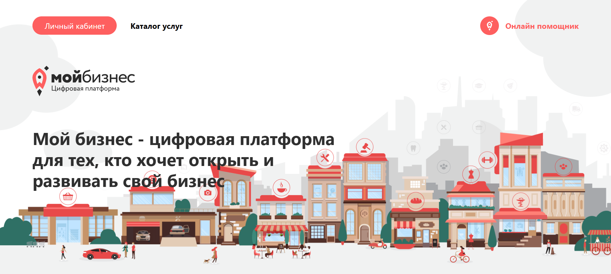

# MyBusiness-landing-page (HTML / Tailwind CSS)

## Overview 🌟

This is a landing page, a modern digital platform for entrepreneurs who want to open and develop their business.

### [Check the Live Demo](https://subbotinroman.github.io/MyBusiness-landing-page/) :point_left:



---

## Stack ⚙️


---

## Features 🚀

-   📱 Adaptive design
-   🎨 Modern UI/UX

---

### Local Development

1. Clone the repository

```bash
git clone https://github.com/subbotinroman/MyBusiness-landing-page.git
```

2. Navigate to project directory

```bash
cd MyBusiness-landing-page
```

3. Open index.html in your browser
    - Double click index.html file
    - Or open via browser: File -> Open File -> select index.html

### Development Setup (Optional)

1. Install Live Server extension in VS Code
2. Right click on index.html
3. Select "Open with Live Server"

### Project Structure

-   `index.html` - main HTML file
-   `tailwind.config.js` - Tailwind CSS configuration
-   `img/` - images directory

Note: Project uses Tailwind CSS via CDN, no additional installation required.
